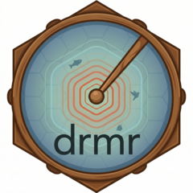

# drmr <a href="https://pinskylab.github.io/drmr/"></a>

<!-- badges: start -->

[](https://github.com/pinskylab/drmr/actions)
[](https://lifecycle.r-lib.org/articles/stages.html#experimental)
<!-- badges: end -->

`drmr` (pronounced *drummer*) is an `R` package for fitting dynamic
range models. Inference is carried out in a Bayesian framework via
Markov Chain Monte Carlo (MCMC) samples available in `Stan`.

### Installation

The installation of the development version from GitHub can be done via

``` r
remotes::install_github("pinskylab/drmr")
## or devtools::install_github("pinskylab/drmr")
```
