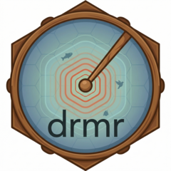

# drmr <a href="https://pinskylab.github.io/drmr/"></a>

<!-- badges: start -->

[](https://github.com/pinskylab/drmr/actions)
[](https://lifecycle.r-lib.org/articles/stages.html#experimental)
<!-- badges: end -->

> **Warning:** If working on a MacOS (or Linux) machine, one should
> install `data.table` and `cmdstanr` from source in order to use the
> package. Otherwise, one get `segmentation fault` errors that are hard
> to debug (and also not a `drmr`, but rather a `cmdstanr` issue).
> Moreover, we recommend installing
> [`instantiate`](https://github.com/wlandau/instantiate/) from GitHub
> instead of CRAN.

`drmr` (pronounced *drummer*) is an `R` package for fitting dynamic
range models to spatiotemporal data on species abundance. Dynamic range
models are spatial population models in which demographic rates (e.g.,
reproduction or mortality) are influenced by the environment. Inference
is carried out in a Bayesian framework via Markov Chain Monte Carlo
(MCMC) samples available in `Stan`.

For details, please see Vignettes linked below and [da Cunha Godoy et
al. 2026](https://ecoevorxiv.org/repository/view/12564/).

### Installation

The installation of the development version from GitHub can be done via

``` r
remotes::install_github("pinskylab/drmr")
## or devtools::install_github("pinskylab/drmr")
```

### Vignettes

- [Get
  started](https://pinskylab.github.io/drmr/articles/get-started.html)
- [Theoretical
  background](https://pinskylab.github.io/drmr/articles/theory.html)
- [Algorithms](https://pinskylab.github.io/drmr/articles/algos.html)
- [Initializing
  densities](https://pinskylab.github.io/drmr/articles/init.html)
- [Parameterization of the density
  functions](https://pinskylab.github.io/drmr/articles/parametrization.html)
- [Advanced
  features](https://pinskylab.github.io/drmr/articles/advanced-features.html)
