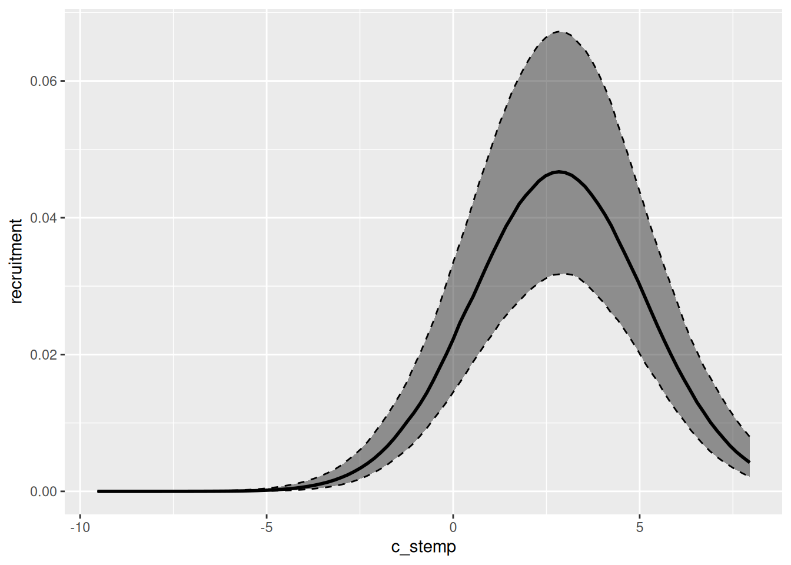
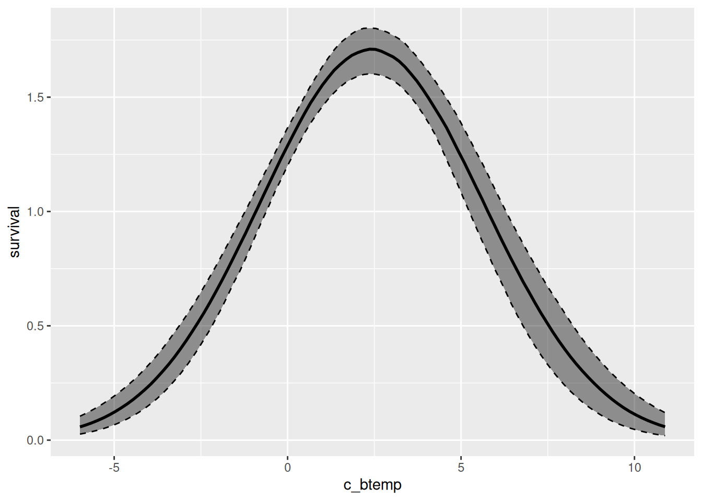
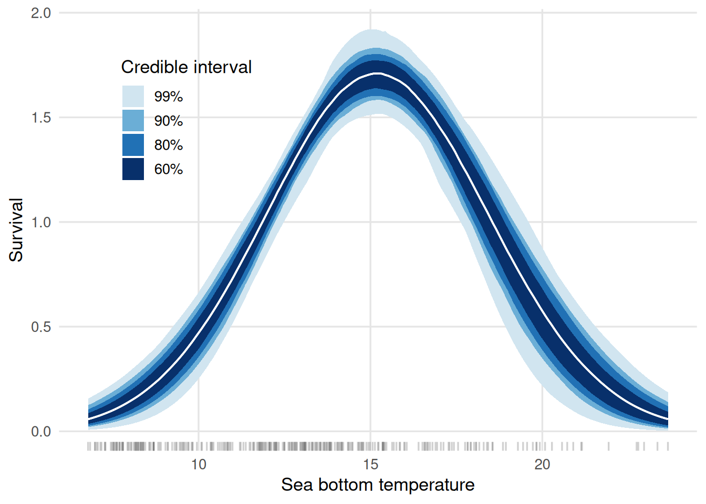
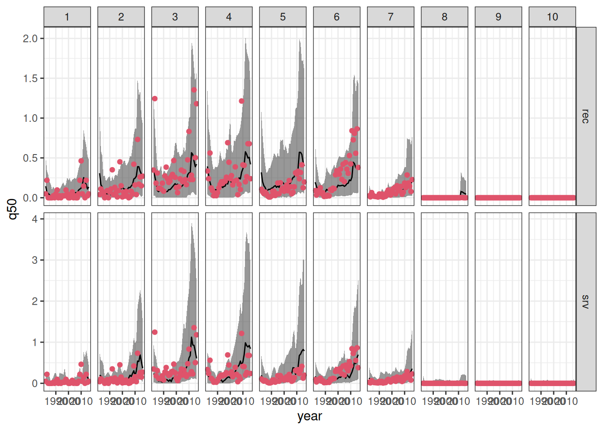
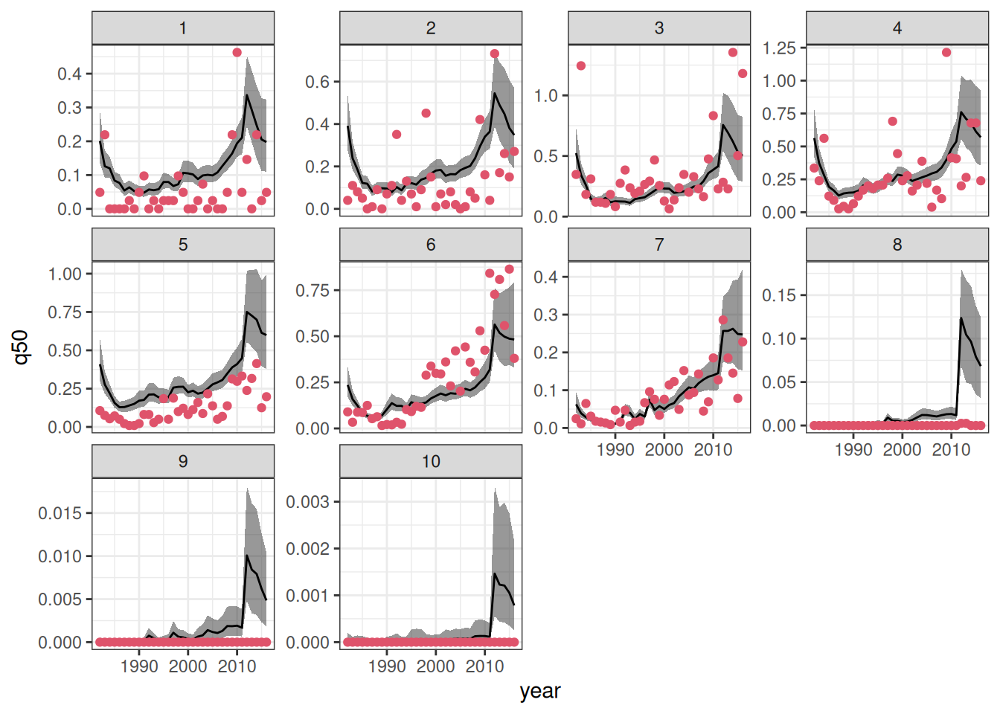
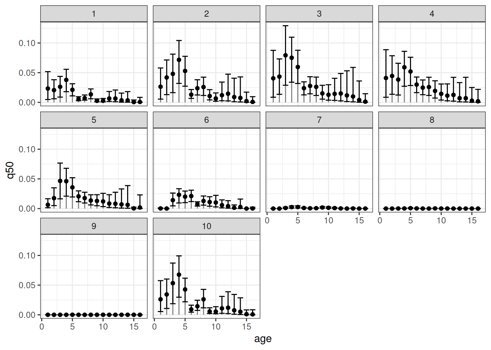
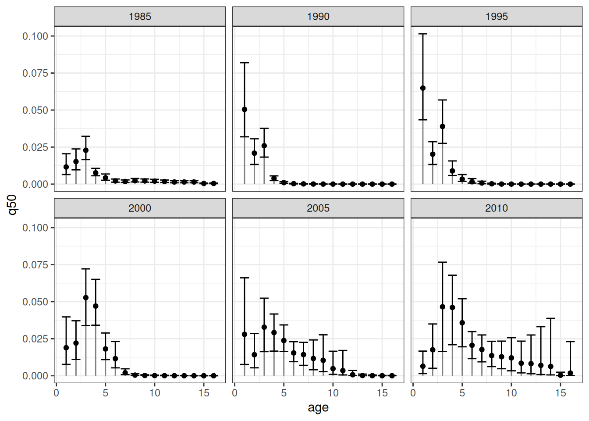

# Advanced features

## TL; DR

This document demonstrates some of the functionalities of the `drmr` R
package for fitting Dynamic Range and Species Distribution Models (DRMs
and SDMs, respectively) using pre-compiled `Stan` models.

We will show how to:

1.  Visualize the estimated relationship between demographic processes
    and the environment
2.  Visualize and assess out of sample predictions
3.  Visualize the estimated age-specific densities

## Setup

The code below loads the packages necessary to reproduce the examples in
this document.

``` r
library(drmr)
library(sf) ## "mapping"
```

    Linking to GEOS 3.12.1, GDAL 3.8.4, PROJ 9.4.0; sf_use_s2() is TRUE

``` r
library(ggplot2) ## graphs
library(bayesplot) ## and more graphs
```

    This is bayesplot version 1.15.0

    - Online documentation and vignettes at mc-stan.org/bayesplot

    - bayesplot theme set to bayesplot::theme_default()

       * Does _not_ affect other ggplot2 plots

       * See ?bayesplot_theme_set for details on theme setting

``` r
library(dplyr)
```

    Attaching package: 'dplyr'

    The following object is masked from 'package:drmr':

        between

    The following objects are masked from 'package:stats':

        filter, lag

    The following objects are masked from 'package:base':

        intersect, setdiff, setequal, union

## Data

For this example, we’ll use the package’s built-in *Summer flounder*
dataset, which resembles the data analyzed in Fredston et al.
([2025](#ref-fredston2025dynamic)). We load it by running:

``` r
## loads the data
data(sum_fl)

## computing density
sum_fl <- sum_fl |>
  mutate(dens = 100 * y / area_km2,
         .before = y)
```

A quick exploration of the data reveals the following:

- Surface salinity (ssalin) and bottom salinity (bsalin) have missing
  values (around 30% missing for each).

- At least 25% of the density (`dens`) values are zero.

Finally, we split the data, reserving the last five years for evaluating
predictions:

``` r
## 5 years-ahead predictions
first_year_forecast <- max(sum_fl$year) - 4

first_id_forecast <-
  first_year_forecast - min(sum_fl$year) + 1

years_all <- order(unique(sum_fl$year))
years_train <- years_all[years_all < first_id_forecast]
years_test <- years_all[years_all >= first_id_forecast]

## splitting data
dat_test <- sum_fl |>
  filter(year >= first_year_forecast)

dat_train <- sum_fl |>
  filter(year < first_year_forecast)
```

When fitting models with explanatory variables, it’s good practice to
standardize them by centering (subtracting the mean) and scaling
(dividing by the standard deviation). This transformation to zero mean
and unit variance offers two main benefits: it typically improves the
efficiency of Monte Carlo Markov Chain (MCMC) sampling, and it makes
comparing the magnitude of regression coefficients easier for assessing
relative variable importance. For applications involving forecasting or
prediction, it is crucial to calculate the mean and standard deviation
for standardization using only the training dataset. These exact same
values must then be applied to standardize the test dataset (or any
future data), simulating the real-world scenario where information about
future observations is unavailable during model fitting.

In that spirit, we center and scale some of our potential explanatory
variables as follows:

``` r
avgs <- c("stemp" = mean(dat_train$stemp),
          "btemp" = mean(dat_train$btemp),
          "depth" = mean(dat_train$depth),
          "n_hauls" = mean(dat_train$n_hauls),
          "lat" = mean(dat_train$lat),
          "lon" = mean(dat_train$lon))

min_year <- dat_train$year |>
  min()

## centering covariates
dat_train <- dat_train |>
  mutate(c_stemp = stemp - avgs["stemp"],
         c_btemp = btemp - avgs["btemp"],
         c_hauls = n_hauls - avgs["n_hauls"],
         c_lat   = lat - avgs["lat"],
         c_lon   = lon - avgs["lon"],
         time  = year - min_year)

dat_test <- dat_test |>
  mutate(c_stemp = stemp - avgs["stemp"],
         c_btemp = btemp - avgs["btemp"],
         c_hauls = n_hauls - avgs["n_hauls"],
         c_lat   = lat - avgs["lat"],
         c_lon   = lon - avgs["lon"],
         time  = year - min_year)
```

> For an extensive list of the variables present in this dataset run:
> [`?sum_fl`](https://pinskylab.github.io/drmr/reference/sum_fl.md).

## Fitting models

The models fitted here will explore some of the interesting features
available in the package. Auxiliary information on age-specific
mortality rates and an adjacency matrix will be used to leverage the
DRMs. The adjacency matrix simply indicate which patches share boarders
with each other. That information may be used either for spatial random
effects or to establish a movement component in the latent underlying
population dynamics.

The mortality rates associated with the *Summer flounder* dataset are
shipped with the package. The mortality rates are stored in a matrix
having the number of columns corresponding to the number of timepoints
in our dataset, and number of columns corresponding to the total number
of age-groups observed for the species. To load that matrix in our `R`
session, we run:

``` r
fmat <-
  system.file("fmat.rds", package = "drmr") |>
  readRDS()

## splitting between train and test for model assessment
f_train <- fmat[, years_train]
f_test  <- fmat[, years_test]
```

Now, we load a shapefile associated with the patches used in the dataset
to construct the adjacency matrix:

``` r
## loading map
shp_sum_fl <- system.file("maps/sum_fl.shp", package = "drmr") |>
  st_read()
```

    Reading layer `sum_fl' from data source
      `/home/runner/work/_temp/Library/drmr/maps/sum_fl.shp' using driver `ESRI Shapefile'
    Simple feature collection with 10 features and 3 fields
    Geometry type: MULTIPOLYGON
    Dimension:     XY
    Bounding box:  xmin: -75.77033 ymin: 35.18407 xmax: -65.67583 ymax: 44.4013
    Geodetic CRS:  WGS 84

``` r
## constructing adjacency matrix
adj_mat <- gen_adj(st_buffer(st_geometry(shp_sum_fl),
                             dist = 2500))
```

> The `shp_sum_fl` has one row for each patch. It is important that this
> dataset is ordered by the patch id, which should correspond to the
> patch id in the `sum_fl` dataset as well.

Finally, let us fit a model. The model fitted by the `fit_drm` call
below takes into account the following:

1.  Effort: The probability of absence (i.e., probability of observing a
    zero density) is a function of the number of hauls, which serves as
    a proxy for effort.

2.  Recruitment: We assume the relationship between recruitment and sea
    surface temperature is quadratic. In addition, we also include an
    AR(1) term for recruitment (`ar_re = "rec"`).

3.  Survival: We estimate a baseline survival rate which is shared among
    all patches. The survival rates vary over time according to the
    external information provided by `f_train`.

4.  Movement: We assume individuals from ages 3 to 10 may move between
    patches from one year to another.

5.  Initialization: We use the survival rates to initialize the
    population dynamics (see the initialization vignette by running
    [`vignette("init", "drmr")`](https://pinskylab.github.io/drmr/articles/init.md).

``` r
algo_args <- list(parallel_chains = 2,
                  chains = 2,
                  iter_sampling = 200,
                  iter_warmup = 500,
                  show_messages = FALSE,
                  show_exceptions = FALSE)

drm_rec <-
  fit_drm(.data = dat_train,
          y_col = "dens", ## response variable: density
          time_col = "year", ## vector of time points
          site_col = "patch",
          family = "gamma",
          seed = 2026,
          formula_zero = ~ 1 + c_hauls,
          formula_rec = ~ 1 + c_stemp + I(c_stemp * c_stemp),
          formula_surv = ~ 1,
          f_mort = f_train,
          n_ages = NROW(f_train),
          adj_mat = adj_mat, ## A matrix for movement routine
          ages_movement = c(0, 0,
                            rep(1, 12),
                            0, 0), ## ages allowed to move
          .toggles = list(ar_re = "rec",
                          movement = 1,
                          est_surv = 1,
                          est_init = 0,
                          minit = 1),
          algo_args = algo_args)
```

The default algorithm for posterior sampling is `Stan`’s NUTS. You can
control its settings by passing a named list to the `algo_args` argument
in `fit_drm`. Other available algorithms for inference are covered in a
deficated vignette. For further details, see
[`vignette("algos", "drmr")`](https://pinskylab.github.io/drmr/articles/algos.md).

Now, we also fit an alternative model with only one difference: it
assumes the survival rates vary according to the sea bottom temperature,
while recruitment is constant across patches (but varies over time). We
will do it using the `update` method. In that case, all the other
arguments passed to `fit_drm` are kept the same as in the last call.

``` r
drm_srv <-
  update(drm_rec,
         formula_rec = ~ 1,
         formula_surv = ~ 1 + c_btemp + I(c_btemp * c_btemp))
```

## Environment and demographic processes

We can easily visualize the relationship between the environmental
variables and specific demographic processes using the `marg` function.
The output of that function can be plotted by simply calling the `plot`
function. Below, we plot both the relationship between recruitment and
sea surface temperature for the first model we fit, and between survival
and sea bottom temperature for the second model fitted.

``` r
marg(drm_rec, ## model
     process = "rec", ## demographic process
     variable = "c_stemp", ## environmental variable
     prob = .8) |> ## mass of the creible interval
  plot()
```



``` r
marg(drm_srv, ## model
     process = "surv", ## demographic process
     variable = "c_btemp", ## environmental variable
     prob = .8) |> 
  plot()
```



These figures display the centered environmental variables on the
x-axis. We can further customize the plots to have the environmental
variable on the original scale and, moreover, visualize different
credible intervals at once. Below, we show how to achieve that for the
survival plot:

``` r
multiple_cis <-
  marg(drm_srv, process = "surv", variable = "c_btemp",
       summary = FALSE,
       n_pts = 200) |>
  lapply(c(0.6, 0.8, 0.9, 0.99),
         \(pr, .dt) {
           alpha <- (1 - pr) / 2
           probs <- c(alpha, 1 - alpha)
           .dt |>
             group_by(c_btemp) |>
             summarise(srv = median(survival),
                       low = quantile(survival, probs = probs[1]),
                       upp = quantile(survival, probs = probs[2])) |>
             ungroup() |>
             mutate(prob_mass = pr)
         }, .dt = _) |>
  bind_rows() |>
  mutate(c_btemp = c_btemp + avgs["btemp"])

ggplot(data = multiple_cis,
       aes(x = c_btemp,
           group = factor(prob_mass,
                          levels = rev(levels(factor(prob_mass)))))) +
  geom_rug(data = dat_train,
           aes(x = btemp),
           inherit.aes = FALSE,
           alpha = 0.3,
           length = unit(0.02, "npc"),
           colour = "grey40") +
  geom_ribbon(aes(ymin = low, ymax = upp,
                  fill = factor(prob_mass,
                                levels = rev(levels(factor(prob_mass))))),
              colour = NA) +
  geom_line(aes(y = srv), linewidth = 0.6, colour = "white") +
  scale_fill_manual(
    values = c("0.99" = "#d1e5f0",
               "0.9"  = "#6baed6",
               "0.8"  = "#2171b5",
               "0.6"  = "#08306b"),
    labels = \(x) paste0(as.numeric(x) * 100, "%")
  ) +
  labs(x    = "Sea bottom temperature",
       y    = "Survival",
       fill = "Credible interval") +
  theme_minimal(base_size = 13) +
  theme(
      legend.position  = "inside",
      legend.position.inside = c(.2, .75),
      panel.grid.minor = element_blank(),
      panel.grid.major = element_line(colour = "grey90")
  )
```



From the graph, on may infer that the temperature maximizes the survival
rates is around 15 degrees Celsius.

## Comparing out-of-sample predictions

The fitted values (or in-sample predictions) are obtained from the draws
of the posterior predictive distribution. In general, we will be
interested in summarizing those draws for visualization. The code chunk
below shows how to use the `fitted` and `summary` methods to achieve
that goal.

``` r
fitted_rec <- fitted(drm_rec) |>
  summary() |>
  mutate(model = "rec", .before = 1) ## creating a column that identifies the ##
```

    Running standalone generated quantities after 2 MCMC chains, 1 chain at a time ...

    Chain 1 finished in 0.0 seconds.
    Chain 2 finished in 0.0 seconds.

    Both chains finished successfully.
    Mean chain execution time: 0.0 seconds.
    Total execution time: 0.3 seconds.

``` r
                                     ## model

fitted_srv <- fitted(drm_srv) |>
  summary() |>
  mutate(model = "srv", .before = 1) ## creating a column that identifies the
```

    Running standalone generated quantities after 2 MCMC chains, 1 chain at a time ...

    Chain 1 finished in 0.0 seconds.
    Chain 2 finished in 0.0 seconds.

    Both chains finished successfully.
    Mean chain execution time: 0.0 seconds.
    Total execution time: 0.2 seconds.

``` r
                                     ## model
```

The out-of-sample predictions are obtained just as easily:

``` r
predicted_rec <- predict(drm_rec,
                         new_data = dat_test,
                         past_data = filter(dat_train,
                                            year == max(year)),
                         seed = 2026,
                         f_test = f_test) |>
  summary() |>
  mutate(model = "rec", .before = 1) ## creating a column that identifies the ##
```

    Running standalone generated quantities after 2 MCMC chains, 1 chain at a time ...

    Chain 1 finished in 0.0 seconds.
    Chain 2 finished in 0.0 seconds.

    Both chains finished successfully.
    Mean chain execution time: 0.0 seconds.
    Total execution time: 0.2 seconds.

``` r
                                     ## model

predicted_srv <- predict(drm_srv,
                         new_data = dat_test,
                         past_data = filter(dat_train,
                                            year == max(year)),
                         seed = 2026,
                         f_test = f_test) |>
  summary() |>
  mutate(model = "srv", .before = 1) ## creating a column that identifies the
```

    Running standalone generated quantities after 2 MCMC chains, 1 chain at a time ...

    Chain 1 finished in 0.0 seconds.
    Chain 2 finished in 0.0 seconds.

    Both chains finished successfully.
    Mean chain execution time: 0.0 seconds.
    Total execution time: 0.2 seconds.

``` r
                                     ## model
```

We can now combine the in- and out-of-sample predictions to visualize
the results. Moreover, we will join the predictions outputs to the
original data to enhance the visualizations.

``` r
combined_sfl <-
  bind_rows(fitted_rec, predicted_rec,
            fitted_srv, predicted_srv) |>
  mutate(patch = as.integer(patch)) |>
  left_join(sum_fl, by = c("patch", "year"))


ggplot(data = combined_sfl,
       aes(x = year)) +
  geom_ribbon(aes(ymin = q5, ymax = q95),
              alpha = .5) +
  geom_line(aes(y = q50)) +
  geom_point(aes(y = dens), color = 2, pch = 19)+ 
  facet_grid(model ~ patch, scales = "free_y") +
  theme_bw()
```



We can objectively compare the predictions as well.

``` r
combined_sfl <-
  combined_sfl |>
  mutate(type = ifelse(year >= first_year_forecast,
                       "out-of-sample",
                       "in-sample"))

combined_sfl |>
  mutate(mse = dens - q50) |>
  mutate(mse = mse * mse) |>
  group_by(type, model) |>
  summarise(rmse = sqrt(mean(mse))) |>
  knitr::kable()
```

    `summarise()` has regrouped the output.
    ℹ Summaries were computed grouped by type and model.
    ℹ Output is grouped by type.
    ℹ Use `summarise(.groups = "drop_last")` to silence this message.
    ℹ Use `summarise(.by = c(type, model))` for per-operation grouping
      (`?dplyr::dplyr_by`) instead.

| type          | model |      rmse |
|:--------------|:------|----------:|
| in-sample     | rec   | 0.1298228 |
| in-sample     | srv   | 0.1389750 |
| out-of-sample | rec   | 0.2445635 |
| out-of-sample | srv   | 0.3352433 |

As expected, in-sample predictions have lower root mean square error
(RMSE) of prediction when compared to their out-of-sample counterpart.
In both cases, the model that relates recruitment to the environment has
lead to better predictive performance (in terms of RMSE).

## Projections under unknown effort

Often, you may want to project the abundance (measured here as density)
of a species over time. However, since future sampling effort is
unknown, it is crucial to isolate this source of variation.

`drmr` can handle this by projecting the latent density. Latent density
represents the true, unobserved population at a given site. Because our
models assume that observed data captures only a subset of the total
population at a given site and time, the latent density acts as a proxy
for true abundance and will consistently exceed the observed abundance.
Furthermore, because it isolates the underlying biological process from
observation error, the latent density trajectory tends to be much
“smoother”.

You can compute the in- and out-of-sample latent abundances by passing
the `type = "latent"` argument to the `fitted` and `predict` functions:

``` r
fitted_rl <- fitted(drm_rec, type = "latent") |>
  summary() 
```

    Running standalone generated quantities after 2 MCMC chains, 1 chain at a time ...

    Chain 1 finished in 0.0 seconds.
    Chain 2 finished in 0.0 seconds.

    Both chains finished successfully.
    Mean chain execution time: 0.0 seconds.
    Total execution time: 0.2 seconds.

``` r
predicted_rl <- predict(drm_rec,
                        new_data = dat_test,
                        past_data = filter(dat_train,
                                           year == max(year)),
                        seed = 2026,
                        f_test = f_test,
                        type = "latent") |>
  summary()
```

    Running standalone generated quantities after 2 MCMC chains, 1 chain at a time ...

    Chain 1 finished in 0.0 seconds.
    Chain 2 finished in 0.0 seconds.

    Both chains finished successfully.
    Mean chain execution time: 0.0 seconds.
    Total execution time: 0.2 seconds.

``` r
combined_rl <- bind_rows(fitted_rl, predicted_rl)
```

Now, we can visualize those:

``` r
combined_rl |>
  mutate(patch = as.integer(patch)) |>
  ## to allow for a comparison with reality
  left_join(sum_fl, by = c("patch", "year")) |>
  ggplot(data = _,
         aes(x = year)) +
  geom_ribbon(aes(ymin = q5, ymax = q95),
              alpha = .5) +
  geom_line(aes(y = q50)) +
  geom_point(aes(y = dens), color = 2, pch = 19)+ 
  facet_wrap(. ~ patch, scales = "free_y") +
  theme_bw()
```



## Visualizing age specific densities

Our package also allows for estimating the age-specific densities. To
compute those, one can simply run:

``` r
lambdas <- ages_edens(drm_rec) |>
  summary() |>
  mutate(patch = as.integer(patch))
```

    Running standalone generated quantities after 2 MCMC chains, 1 chain at a time ...

    Chain 1 finished in 0.0 seconds.
    Chain 2 finished in 0.0 seconds.

    Both chains finished successfully.
    Mean chain execution time: 0.0 seconds.
    Total execution time: 0.8 seconds.

Now, let’s visualize the age-specific densities for all patches at a
given year:

``` r
lambdas |>
  filter(year == 2010) |>  
  ggplot(data = _,
         aes(x = age)) +
  geom_segment(aes(xend = age, y = 0, yend = q50),
               color = "gray50") +
  geom_errorbar(aes(ymin = q5, ymax = q95)) +
  geom_point(aes(y = q50)) +
  facet_wrap(~ patch) +
  theme_bw()
```



The error bars represent the respective 90% credible intervals. An
equivalent visualization for a single patch across time can be obtained
as follows:

``` r
lambdas |>
  filter(patch == 5) |>
  filter(year %in% seq(1985, 2010, by = 5)) |>
  ggplot(data = _,
         aes(x = age)) +
  geom_segment(aes(xend = age, y = 0, yend = q50),
               color = "gray50") +
  geom_errorbar(aes(ymin = q5, ymax = q95)) +
  geom_point(aes(y = q50)) +
  facet_wrap(~ year) +
  theme_bw()
```



## References

Fredston, Alexa, Daniel Ovando, Lucas da Cunha Godoy, Jude Kong, Brandon
Muffley, James T Thorson, and Malin Pinsky. 2025. “Dynamic Range Models
Improve the Near-Term Forecast for a Marine Species on the Move.”
<https://doi.org/10.32942/X24D00>.
