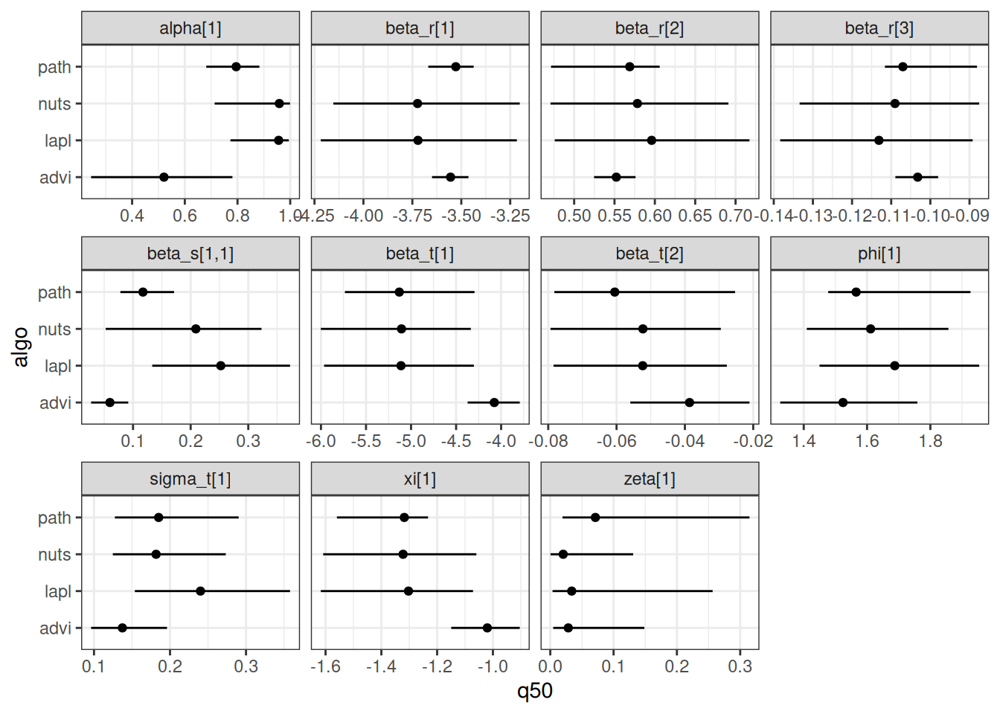
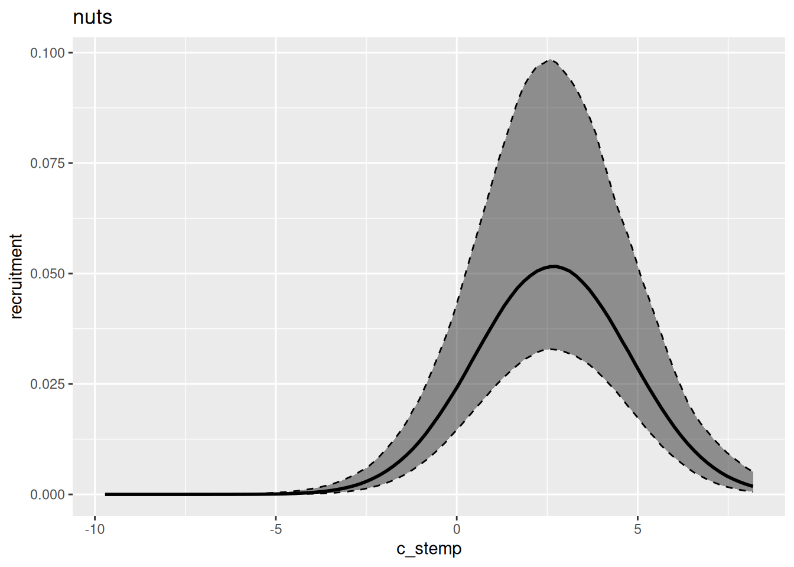
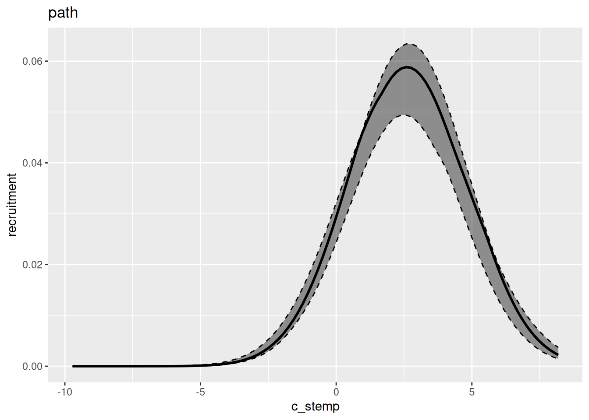
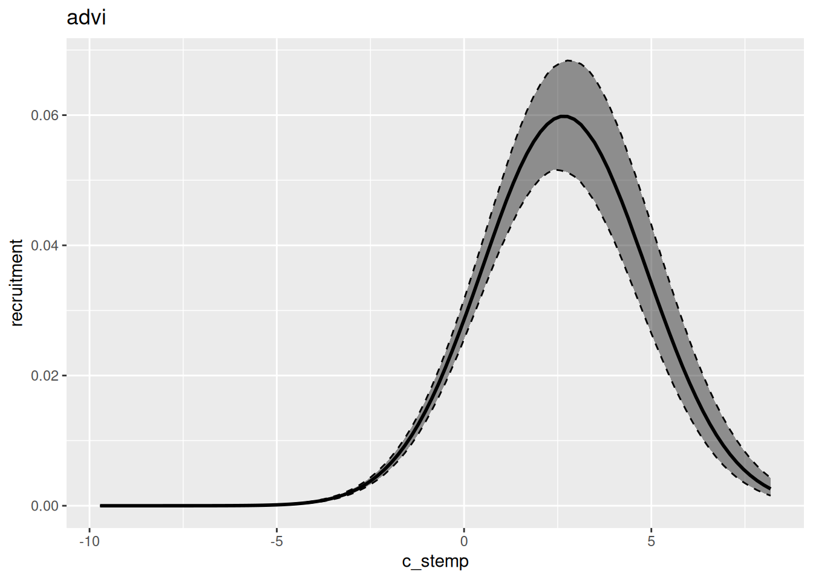
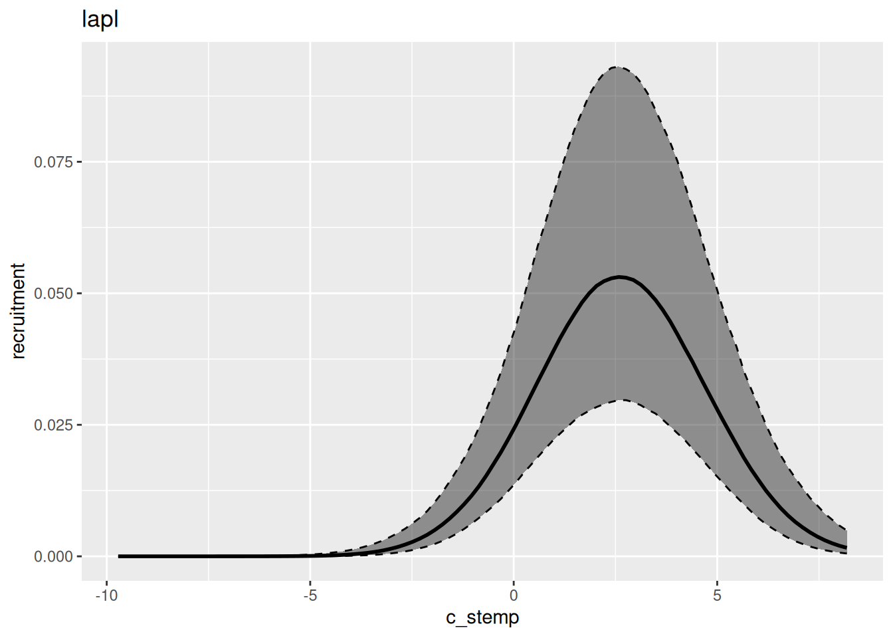

# Algorithms

## TL; DR

This document demonstrates how to modify the algorithm used for
inference in our models.

## Setup

The setup and data-processing for this vignette is the same as in the
“Advanced features” vignette. For further details, see
[`vignette("advanced-features", "drmr")`](https://pinskylab.github.io/drmr/articles/advanced-features.md).
Unlike the examples in that vignette, we will not split the data into
train and test, but rather just look at parameters’ estimates obtained
through different algorithms.

``` r
library(drmr)
library(sf) ## "mapping"
```

    Linking to GEOS 3.12.1, GDAL 3.8.4, PROJ 9.4.0; sf_use_s2() is TRUE

``` r
library(ggplot2) ## graphs
library(bayesplot) ## and more graphs
```

    This is bayesplot version 1.15.0

    - Online documentation and vignettes at mc-stan.org/bayesplot

    - bayesplot theme set to bayesplot::theme_default()

       * Does _not_ affect other ggplot2 plots

       * See ?bayesplot_theme_set for details on theme setting

``` r
library(dplyr)
```

    Attaching package: 'dplyr'

    The following object is masked from 'package:drmr':

        between

    The following objects are masked from 'package:stats':

        filter, lag

    The following objects are masked from 'package:base':

        intersect, setdiff, setequal, union

``` r
## loads the data
data(sum_fl)

## computing density
sum_fl <- sum_fl |>
  mutate(dens = 100 * y / area_km2,
         .before = y)

avgs <- c("stemp" = mean(sum_fl$stemp),
          "btemp" = mean(sum_fl$btemp),
          "depth" = mean(sum_fl$depth),
          "n_hauls" = mean(sum_fl$n_hauls),
          "lat" = mean(sum_fl$lat),
          "lon" = mean(sum_fl$lon))

min_year <- sum_fl$year |>
  min()

## centering covariates
sum_fl <- sum_fl |>
  mutate(c_stemp = stemp - avgs["stemp"],
         c_btemp = btemp - avgs["btemp"],
         c_hauls = n_hauls - avgs["n_hauls"],
         c_lat   = lat - avgs["lat"],
         c_lon   = lon - avgs["lon"],
         time  = year - min_year)

## mortality rates
fmat <-
  system.file("fmat.rds", package = "drmr") |>
  readRDS()

shp_sum_fl <- system.file("maps/sum_fl.shp", package = "drmr") |>
  st_read()
```

    Reading layer `sum_fl' from data source
      `/home/runner/work/_temp/Library/drmr/maps/sum_fl.shp' using driver `ESRI Shapefile'
    Simple feature collection with 10 features and 3 fields
    Geometry type: MULTIPOLYGON
    Dimension:     XY
    Bounding box:  xmin: -75.77033 ymin: 35.18407 xmax: -65.67583 ymax: 44.4013
    Geodetic CRS:  WGS 84

``` r
## constructing adjacency matrix
adj_mat <- gen_adj(st_buffer(st_geometry(shp_sum_fl),
                             dist = 2500))
```

> For an extensive list of the variables present in this dataset run:
> [`?sum_fl`](https://pinskylab.github.io/drmr/reference/sum_fl.md).

## Fitting a model using different algorithms

We will start with the default algorithm (NUTS). By default, it runs 4
chains sequentially, with a warmup period od 1000 samples and,
subsequently, 1000 samples per chain. Here, we are running two chains in
parallel, with a warmup of 500 and drawing 500 samples.

``` r
nuts_args <- list(parallel_chains = 2,
                  chains = 2,
                  iter_sampling = 500,
                  iter_warmup = 500,
                  show_messages = FALSE,
                  show_exceptions = FALSE)

drm_nuts <-
  fit_drm(.data = sum_fl,
          y_col = "dens", ## response variable: density
          time_col = "year", ## vector of time points
          site_col = "patch",
          family = "gamma",
          seed = 2026,
          formula_zero = ~ 1 + c_hauls,
          formula_rec = ~ 1 + c_stemp + I(c_stemp * c_stemp),
          formula_surv = ~ 1,
          f_mort = fmat[, -1],
          n_ages = NROW(fmat),
          adj_mat = adj_mat, ## A matrix for movement routine
          ages_movement = c(0, 0,
                            rep(1, 12),
                            0, 0), ## ages allowed to move
          .toggles = list(ar_re = "rec",
                          movement = 1,
                          est_surv = 1,
                          est_init = 0,
                          minit = 1),
          algo_args = nuts_args)
```

    Warning: 10 of 1000 (1.0%) transitions ended with a divergence.
    See https://mc-stan.org/misc/warnings for details.

Next, we obtain samples from the *variational* posterior using Stan’s
Automatic Differentiation Variational Inference (ADVI) algorithm (for
for details see [this
link](https://mc-stan.org/docs/cmdstan-guide/variational_config.html)).

``` r
advi_args <- list(show_messages = FALSE,
                  show_exceptions = FALSE,
                  iter = 10^5, ## maximum number of iterations (optimization)
                  draws = 1000) ## number of samples from the posterior

drm_advi <-
  fit_drm(.data = sum_fl,
          y_col = "dens", ## response variable: density
          time_col = "year", ## vector of time points
          site_col = "patch",
          family = "gamma",
          seed = 2026,
          formula_zero = ~ 1 + c_hauls,
          formula_rec = ~ 1 + c_stemp + I(c_stemp * c_stemp),
          formula_surv = ~ 1,
          f_mort = fmat[, -1],
          n_ages = NROW(fmat),
          adj_mat = adj_mat, ## A matrix for movement routine
          ages_movement = c(0, 0,
                            rep(1, 12),
                            0, 0), ## ages allowed to move
          .toggles = list(ar_re = "rec",
                          movement = 1,
                          est_surv = 1,
                          est_init = 0,
                          minit = 1),
          algo_args = advi_args,
          algorithm = "vb") ## vb stands for variational Bayes
```

Another algorithm option is the
[Pathfinder](https://mc-stan.org/docs/cmdstan-guide/pathfinder_config.html).
Pathfinder also relies on variational inference. It is usually better
than ADVI, especially when the posteriors (in the unconstrained space)
are not unimodal and bell-shaped. We will demonstrate how the inference
algorithm can be updated using the `update` method:

``` r
path_args <- list(show_messages = FALSE,
                  show_exceptions = FALSE,
                  max_lbfgs_iters = 10^4)

drm_path <-
  update(drm_advi,
         algo_args = path_args,
         algorithm = "pathfinder")
```

    Optimization terminated with error: Line search failed to achieve a sufficient decrease, no more progress can be made Stan will still attempt pathfinder but may fail or produce incorrect results.

    Only 3 of the 4 pathfinders succeeded.

    Pareto k value (2.4) is greater than 0.7. Importance resampling was not able to improve the approximation, which may indicate that the approximation itself is poor.

It is also possible to obtain samples from a Laplace approximation of
the posterior as follows:

``` r
lapl_args <- list(show_messages = FALSE,
                  show_exceptions = FALSE)

drm_lapl <-
  update(drm_path,
         algo_args = lapl_args,
         algorithm = "laplace")
```

    Rejecting initial value:
      Log probability evaluates to log(0), i.e. negative infinity.
      Stan can't start sampling from this initial value.
    Rejecting initial value:
      Log probability evaluates to log(0), i.e. negative infinity.
      Stan can't start sampling from this initial value.
    Rejecting initial value:
      Log probability evaluates to log(0), i.e. negative infinity.
      Stan can't start sampling from this initial value.
    Initial log joint probability = -48954.1
        Iter      log prob        ||dx||      ||grad||       alpha      alpha0  # evals  Notes
    Exception: Exception: gamma_lpdf: Inverse scale parameter[1] is inf, but must be positive finite! (in '/tmp/Rtmp77Yui3/pkg-lib1aba1e483534/drmr/bin/stan/utils/lpdfs.stan', line 97, column 4, included from
    '/tmp/RtmpJsUOE8/model-27b4495e770c.stan', line 2, column 0) (in '/tmp/RtmpJsUOE8/model-27b4495e770c.stan', line 312, column 2 to line 315, column 67)
    Error evaluating model log probability: Non-finite gradient.
          99       66.5623     0.0139267       89.6602      0.2505      0.2505      137
        Iter      log prob        ||dx||      ||grad||       alpha      alpha0  # evals  Notes
         199       81.4715     0.0802359       75.8498           1           1      258
        Iter      log prob        ||dx||      ||grad||       alpha      alpha0  # evals  Notes
         299       86.1945    0.00343466       30.3285           1           1      391
        Iter      log prob        ||dx||      ||grad||       alpha      alpha0  # evals  Notes
         399       87.7316    0.00281463       6.25863      0.5164      0.5164      509
        Iter      log prob        ||dx||      ||grad||       alpha      alpha0  # evals  Notes
         499       88.1937     0.0015151       10.4457      0.1523      0.1523      630
        Iter      log prob        ||dx||      ||grad||       alpha      alpha0  # evals  Notes
         599       88.5664     0.0153683       11.3606           1           1      743
        Iter      log prob        ||dx||      ||grad||       alpha      alpha0  # evals  Notes
         699       88.6292    0.00261836       3.29099      0.5845      0.5845      874
        Iter      log prob        ||dx||      ||grad||       alpha      alpha0  # evals  Notes
         799        88.643    0.00122253       1.31178           1           1     1004
        Iter      log prob        ||dx||      ||grad||       alpha      alpha0  # evals  Notes
         899       88.6458    0.00122597       1.60837           1           1     1127
        Iter      log prob        ||dx||      ||grad||       alpha      alpha0  # evals  Notes
         999       88.6474   0.000144826      0.102757      0.4141      0.4141     1239
        Iter      log prob        ||dx||      ||grad||       alpha      alpha0  # evals  Notes
        1033       88.6475   0.000180893     0.0356464           1           1     1277
    Optimization terminated normally:
      Convergence detected: relative gradient magnitude is below tolerance
    Finished in  0.8 seconds.

The code below computes the parameter estimates for each of the methods,
and then makes a graph to compare them.

``` r
bind_rows(
    mutate(summary(drm_nuts)$estimates, algo = "nuts"),
    mutate(summary(drm_advi)$estimates, algo = "advi"),
    mutate(summary(drm_path)$estimates, algo = "path"),
    mutate(summary(drm_lapl)$estimates, algo = "lapl")
) |>
  ggplot(data = _,
         aes(x = q50,
             y = algo)) +
  geom_linerange(aes(xmin = q5, xmax = q95)) +
  geom_point() +
  facet_wrap(~ variable, scales = "free_x") +
  theme_bw()
```



In general, variational inference methods are known for underestimating
the uncertainty around the parameter estimates. We can also look at the
estimated relationship between environment and recruitment for each of
those methods:

``` r
marg(drm_nuts, "rec", "c_stemp") |>
  plot() +
  labs(title = "nuts")
marg(drm_path, "rec", "c_stemp") |>
  plot() +
  labs(title = "path")
marg(drm_advi, "rec", "c_stemp") |>
  plot() +
  labs(title = "advi")
marg(drm_lapl, "rec", "c_stemp") |>
  plot() +
  labs(title = "lapl")
```









## References
