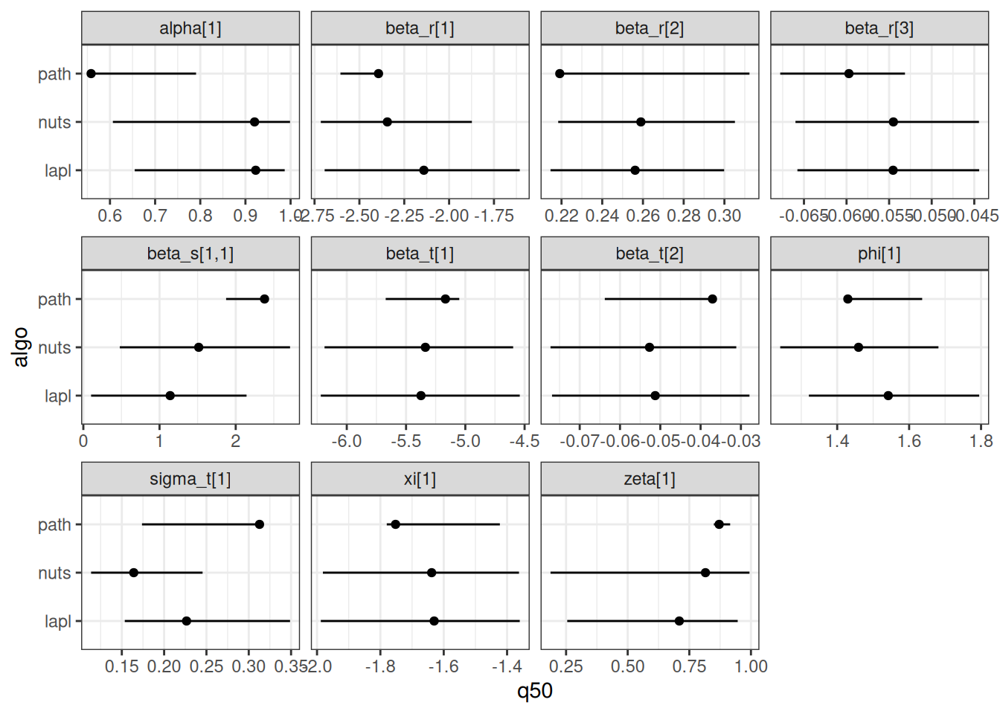
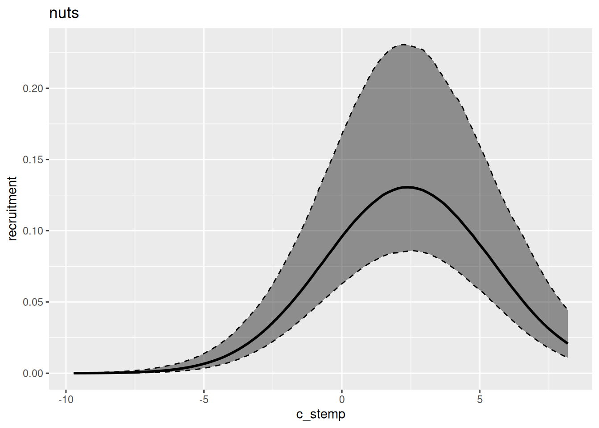
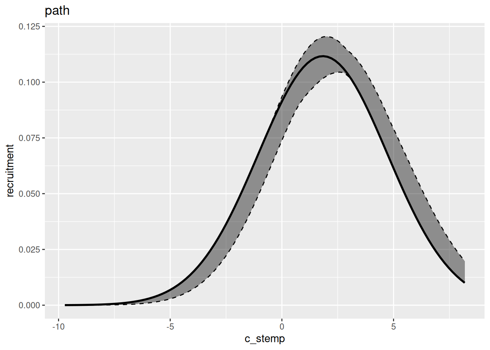
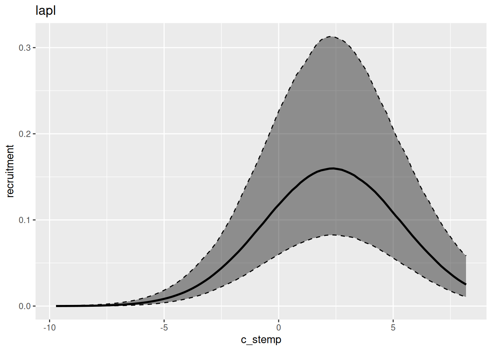

# Algorithms

## TL; DR

This document demonstrates how to modify the algorithm used for
inference in our models. In general, the default algorithm (the NUTS
from `Stan`) represents the gold standard, but it is slow. For initial
screening (or even cross-validation), one can rely on the other
algorithms showcased in this vignette. They tend to be faster, and
produce reliable point estimates but have a weaker performance in
quantifying the uncertainty around their estimates.

## Setup

The setup and data-processing for this vignette is the same as in the
“Advanced features” vignette. For further details, see
[`vignette("advanced-features", "drmr")`](https://pinskylab.github.io/drmr/articles/advanced-features.md).
Unlike the examples in that vignette, we will not split the data into
train and test, but rather just look at parameters’ estimates obtained
through different algorithms.

``` r

library(drmr)
library(sf) ## "mapping"
```

    Linking to GEOS 3.12.1, GDAL 3.8.4, PROJ 9.4.0; sf_use_s2() is TRUE

``` r

library(ggplot2) ## graphs
library(bayesplot) ## and more graphs
```

    This is bayesplot version 1.16.0

    - Online documentation and vignettes at mc-stan.org/bayesplot

    - bayesplot theme set to bayesplot::theme_default()

       * Does _not_ affect other ggplot2 plots

       * See ?bayesplot_theme_set for details on theme setting

``` r

library(dplyr)
```


    Attaching package: 'dplyr'

    The following object is masked from 'package:drmr':

        between

    The following objects are masked from 'package:stats':

        filter, lag

    The following objects are masked from 'package:base':

        intersect, setdiff, setequal, union

``` r

## loads the data
data(sum_fl)

## computing density
sum_fl <- sum_fl |>
  mutate(dens = 100 * y / area_km2,
         .before = y)

avgs <- c("stemp" = mean(sum_fl$stemp),
          "btemp" = mean(sum_fl$btemp),
          "depth" = mean(sum_fl$depth),
          "n_hauls" = mean(sum_fl$n_hauls),
          "lat" = mean(sum_fl$lat),
          "lon" = mean(sum_fl$lon))

min_year <- sum_fl$year |>
  min()

## centering covariates
sum_fl <- sum_fl |>
  mutate(c_stemp = stemp - avgs["stemp"],
         c_btemp = btemp - avgs["btemp"],
         c_hauls = n_hauls - avgs["n_hauls"],
         c_lat   = lat - avgs["lat"],
         c_lon   = lon - avgs["lon"],
         time  = year - min_year)

## mortality rates
fmat <-
  system.file("fmat.rds", package = "drmr") |>
  readRDS()

shp_sum_fl <- system.file("maps/sum_fl.shp", package = "drmr") |>
  st_read()
```

    Reading layer `sum_fl' from data source
      `/home/runner/work/_temp/Library/drmr/maps/sum_fl.shp' using driver `ESRI Shapefile'
    Simple feature collection with 10 features and 3 fields
    Geometry type: MULTIPOLYGON
    Dimension:     XY
    Bounding box:  xmin: -75.77033 ymin: 35.18407 xmax: -65.67583 ymax: 44.4013
    Geodetic CRS:  WGS 84

``` r

## constructing adjacency matrix
adj_mat <- gen_adj(st_buffer(st_geometry(shp_sum_fl),
                             dist = 2500))
```

> For an extensive list of the variables present in this dataset run:
> [`?sum_fl`](https://pinskylab.github.io/drmr/reference/sum_fl.md).

## Fitting a model using different algorithms

We will start with the default algorithm (NUTS). By default, it runs 4
chains sequentially, with a warmup period od 1000 samples and,
subsequently, 1000 samples per chain. Here, we are running two chains in
parallel, with a warmup of 500 and drawing 500 samples.

``` r

nuts_args <- list(parallel_chains = 2,
                  chains = 2,
                  iter_sampling = 500,
                  iter_warmup = 500,
                  show_messages = FALSE,
                  show_exceptions = FALSE)

drm_nuts <-
  fit_drm(.data = sum_fl,
          y_col = "dens", ## response variable: density
          time_col = "year", ## vector of time points
          site_col = "patch",
          family = "gamma",
          seed = 2026,
          formula_zero = ~ 1 + c_hauls,
          formula_rec = ~ 1 + c_stemp + I(c_stemp * c_stemp),
          formula_surv = ~ 1,
          f_mort = fmat[, -1],
          n_ages = NROW(fmat),
          adj_mat = adj_mat, ## A matrix for movement routine
          ages_movement = c(0, 0,
                            rep(1, 12),
                            0, 0), ## ages allowed to move
          .toggles = list(ar_re = "rec",
                          movement = 1,
                          est_surv = 1,
                          est_init = 0,
                          minit = 1),
          algo_args = nuts_args)
```

    Warning: 2 of 1000 (0.0%) transitions ended with a divergence.
    See https://mc-stan.org/misc/warnings for details.

Next, we obtain samples from the *variational* posterior using Stan’s
Automatic Differentiation Variational Inference (ADVI) algorithm (for
for details see [this
link](https://mc-stan.org/docs/cmdstan-guide/variational_config.html)).

``` r

## in our tests, this algorithm has been the least stable so far.

advi_args <- list(show_messages = FALSE,
                  show_exceptions = FALSE,
                  iter = 10^5, ## maximum number of iterations (optimization)
                  draws = 4000) ## number of samples from the posterior

drm_advi <-
  update(drm_nuts,
         algo_args = advi_args,
         algorithm = "vb") ## vb stands for variational Bayes
```

Another algorithm option is the
[Pathfinder](https://mc-stan.org/docs/cmdstan-guide/pathfinder_config.html).
Pathfinder also relies on variational inference. It is usually better
than ADVI, especially when the posteriors (in the unconstrained space)
are not unimodal and bell-shaped. We will demonstrate how the inference
algorithm can be updated using the `update` method:

``` r

path_args <- list(show_messages = FALSE,
                  show_exceptions = FALSE,
                  max_lbfgs_iters = 10^4)

drm_path <-
  update(drm_nuts,
         algo_args = path_args,
         algorithm = "pathfinder")
```

It is also possible to obtain samples from a Laplace approximation of
the posterior as follows:

``` r

lapl_args <- list(show_messages = FALSE,
                  show_exceptions = FALSE)

drm_lapl <-
  update(drm_nuts,
         algo_args = lapl_args,
         algorithm = "laplace")
```

    Rejecting initial value:
      Log probability evaluates to log(0), i.e. negative infinity.
      Stan can't start sampling from this initial value.
    Rejecting initial value:
      Log probability evaluates to log(0), i.e. negative infinity.
      Stan can't start sampling from this initial value.
    Rejecting initial value:
      Log probability evaluates to log(0), i.e. negative infinity.
      Stan can't start sampling from this initial value.
    Initial log joint probability = -57554.4
        Iter      log prob        ||dx||      ||grad||       alpha      alpha0  # evals  Notes
    Exception: Exception: gamma_lpdf: Inverse scale parameter[1] is inf, but must be positive finite! (in '/tmp/RtmpOmMiLa/pkg-lib1a4170683f5f/drmr/bin/stan/utils/lpdfs.stanfunctions', line 97, column 4, included from
    '/tmp/RtmptcMIhf/model-274c2a88beed.stan', line 2, column 0) (in '/tmp/RtmptcMIhf/model-274c2a88beed.stan', line 363, column 2 to line 366, column 67)
    Exception: Exception: gamma_lpdf: Inverse scale parameter[1] is inf, but must be positive finite! (in '/tmp/RtmpOmMiLa/pkg-lib1a4170683f5f/drmr/bin/stan/utils/lpdfs.stanfunctions', line 97, column 4, included from
    '/tmp/RtmptcMIhf/model-274c2a88beed.stan', line 2, column 0) (in '/tmp/RtmptcMIhf/model-274c2a88beed.stan', line 363, column 2 to line 366, column 67)
    Error evaluating model log probability: Non-finite gradient.
    Error evaluating model log probability: Non-finite gradient.
    Error evaluating model log probability: Non-finite gradient.
          99       46.6639     0.0479171       43.2853           1           1      130
        Iter      log prob        ||dx||      ||grad||       alpha      alpha0  # evals  Notes
         199       61.6008     0.0301142       7.29015           1           1      255
        Iter      log prob        ||dx||      ||grad||       alpha      alpha0  # evals  Notes
         299        63.065     0.0212004       14.0507           1           1      376
        Iter      log prob        ||dx||      ||grad||       alpha      alpha0  # evals  Notes
         399       64.2728      0.022789       18.6164           1           1      504
        Iter      log prob        ||dx||      ||grad||       alpha      alpha0  # evals  Notes
         499       64.4237    0.00170634       3.21613           1           1      623
        Iter      log prob        ||dx||      ||grad||       alpha      alpha0  # evals  Notes
         599       64.4604     0.0135798        2.8787      0.3004           1      743
        Iter      log prob        ||dx||      ||grad||       alpha      alpha0  # evals  Notes
         699       64.4731    7.2782e-05       1.23404        0.24        0.24      867
        Iter      log prob        ||dx||      ||grad||       alpha      alpha0  # evals  Notes
         799       64.4764   0.000123441      0.187555           1           1      988
        Iter      log prob        ||dx||      ||grad||       alpha      alpha0  # evals  Notes
         899       64.4771   3.91112e-05      0.118811           1           1     1103
        Iter      log prob        ||dx||      ||grad||       alpha      alpha0  # evals  Notes
         912       64.4771   2.00926e-05      0.040848           1           1     1119
    Optimization terminated normally:
      Convergence detected: relative gradient magnitude is below tolerance
    Finished in  0.9 seconds.

The code below computes the parameter estimates for each of the methods,
and then makes a graph to compare them.

``` r

bind_rows(
    mutate(summary(drm_nuts)$estimates, algo = "nuts"),
    ## mutate(summary(drm_advi)$estimates, algo = "advi"),
    mutate(summary(drm_path)$estimates, algo = "path"),
    mutate(summary(drm_lapl)$estimates, algo = "lapl")
) |>
  ggplot(data = _,
         aes(x = q50,
             y = algo)) +
  geom_linerange(aes(xmin = q5, xmax = q95)) +
  geom_point() +
  facet_wrap(~ variable, scales = "free_x") +
  theme_bw()
```



In general, variational inference methods are known for underestimating
the uncertainty around the parameter estimates. We can also look at the
estimated relationship between environment and recruitment for each of
those methods:

``` r

effects_drm(drm_nuts, "rec", "c_stemp") |>
  plot() +
  labs(title = "nuts")
effects_drm(drm_path, "rec", "c_stemp") |>
  plot() +
  labs(title = "path")
## effects_drm(drm_advi, "rec", "c_stemp") |>
##   plot() +
##   labs(title = "advi")

effects_drm(drm_lapl, "rec", "c_stemp") |>
  plot() +
  labs(title = "lapl")
```







## References
