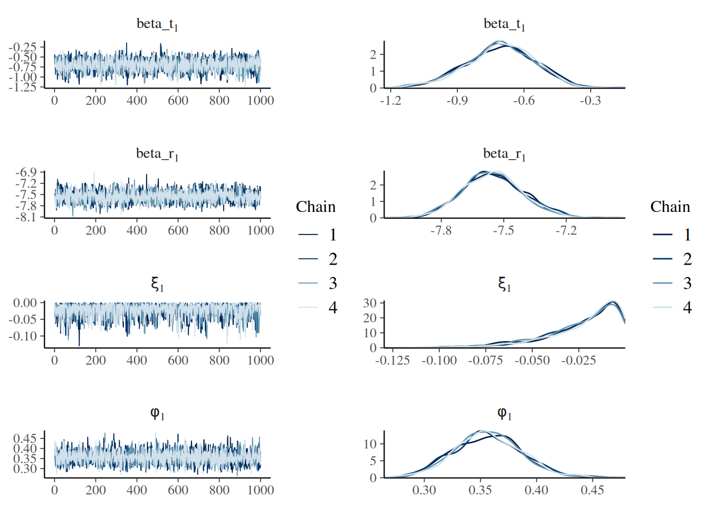

# Get Started

``` r
library(drmr)
library(sf) ## "mapping"
```

    Linking to GEOS 3.12.1, GDAL 3.8.4, PROJ 9.4.0; sf_use_s2() is TRUE

``` r
library(ggplot2) ## graphs
library(bayesplot) ## and more graphs
```

    This is bayesplot version 1.15.0

    - Online documentation and vignettes at mc-stan.org/bayesplot

    - bayesplot theme set to bayesplot::theme_default()

       * Does _not_ affect other ggplot2 plots

       * See ?bayesplot_theme_set for details on theme setting

``` r
library(dplyr)
```

    Attaching package: 'dplyr'

    The following object is masked from 'package:drmr':

        between

    The following objects are masked from 'package:stats':

        filter, lag

    The following objects are masked from 'package:base':

        intersect, setdiff, setequal, union

We will use a dataset included with the package. In particular, this
data is similar to the one analyzed in Fredston et al.
([2025](#ref-fredston2025dynamic)). To load the data, we run:

``` r
data(sum_fl)
```

## Data processing & splitting

To assess model predictions, the chunk below splits the data into train
and test.

``` r
## 5 years-ahead predictions
first_year_forecast <- max(sum_fl$year) - 5

first_id_forecast <-
  first_year_forecast - min(sum_fl$year) + 1

years_all <- length(unique(sum_fl$year))
years_train <- years_all[years_all < first_id_forecast]
years_test <- years_all[years_all >= first_id_forecast]

## splitting data
dat_test <- sum_fl |>
  filter(year >= first_year_forecast)

dat_train <- sum_fl |>
  filter(year < first_year_forecast)
```

Finally, I transform our response variable into a density.

``` r
dat_train <- dat_train |>
  mutate(dens = y / area_km2,
         .before = y)

dat_test <- dat_test |>
  mutate(dens = y / area_km2,
         .before = y)
```

The elements we need to fit a DRM are:

- A response variable representing a density

- A variable encoding time-points

- A variable encoding patches (or sites).

The current version of the functions assumes that we have rows in the
dataset for every combinations of “time” and “site”. That is, if a
dataset comprises observations around the density of a given species
across 20 years and 10 patches, we expect to have 20 rows in the dataset
per patch. Equivalently, we would expect 10 rows in the dataset per
year.

The first and last 10 rows of the `dat_train` object look as follows:

``` r
head(dat_train[, c("year", "patch",  "y", "stemp")],
     n = 10)
```

    # A tibble: 10 × 4
        year patch     y stemp
       <dbl> <int> <dbl> <dbl>
     1  1982     1     2  24.5
     2  1983     1     9  25.4
     3  1984     1     0  20.5
     4  1985     1     0  24.5
     5  1986     1     0  22.6
     6  1987     1     0  25.9
     7  1988     1     1  23.2
     8  1989     1     0  25.8
     9  1990     1     2  24.5
    10  1991     1     4  25.4

``` r
tail(dat_train[, c("year", "patch",  "y", "stemp")],
     n = 10)
```

    # A tibble: 10 × 4
        year patch     y stemp
       <dbl> <int> <dbl> <dbl>
     1  2001    10     0  11.1
     2  2002    10     0  11.6
     3  2003    10     0  10.4
     4  2004    10     0  10.0
     5  2005    10     0  11.1
     6  2006    10     0  11.8
     7  2007    10     0  10.3
     8  2008    10     0  10.2
     9  2009    10     0  10.3
    10  2010    10     0  10.2

`stemp` is an explanatory variable denoting the sea surface temperature
(SST).

## Fitting & diagnosing a model

Provided the dataset is properly formatted, a simple model considering
the existance of `8` age groups and a natural mortality rate of `0.25`
can be fit as follows:

``` r
my_drm <-
  fit_drm(.data = dat_train,
          y_col = "dens",
          time_col = "year",
          site_col = "patch",
          n_ages = 8,
          m = 0.25,
          seed = 2025)
```

    Running MCMC with 4 sequential chains...

    Chain 1 Iteration:    1 / 2000 [  0%]  (Warmup) 

    Chain 1 Informational Message: The current Metropolis proposal is about to be rejected because of the following issue:

    Chain 1 Exception: gamma_lpdf: Random variable is 0, but must be positive finite! (in '/tmp/Rtmp8LMTQe/model-2afb13976e39.stan', line 309, column 4 to column 54)

    Chain 1 If this warning occurs sporadically, such as for highly constrained variable types like covariance matrices, then the sampler is fine,

    Chain 1 but if this warning occurs often then your model may be either severely ill-conditioned or misspecified.

    Chain 1 

    Chain 1 Iteration:  100 / 2000 [  5%]  (Warmup)
    Chain 1 Iteration:  200 / 2000 [ 10%]  (Warmup)
    Chain 1 Iteration:  300 / 2000 [ 15%]  (Warmup)
    Chain 1 Iteration:  400 / 2000 [ 20%]  (Warmup)
    Chain 1 Iteration:  500 / 2000 [ 25%]  (Warmup)
    Chain 1 Iteration:  600 / 2000 [ 30%]  (Warmup)
    Chain 1 Iteration:  700 / 2000 [ 35%]  (Warmup)
    Chain 1 Iteration:  800 / 2000 [ 40%]  (Warmup)
    Chain 1 Iteration:  900 / 2000 [ 45%]  (Warmup)
    Chain 1 Iteration: 1000 / 2000 [ 50%]  (Warmup)
    Chain 1 Iteration: 1001 / 2000 [ 50%]  (Sampling)
    Chain 1 Iteration: 1100 / 2000 [ 55%]  (Sampling)
    Chain 1 Iteration: 1200 / 2000 [ 60%]  (Sampling)
    Chain 1 Iteration: 1300 / 2000 [ 65%]  (Sampling)
    Chain 1 Iteration: 1400 / 2000 [ 70%]  (Sampling)
    Chain 1 Iteration: 1500 / 2000 [ 75%]  (Sampling)
    Chain 1 Iteration: 1600 / 2000 [ 80%]  (Sampling)
    Chain 1 Iteration: 1700 / 2000 [ 85%]  (Sampling)
    Chain 1 Iteration: 1800 / 2000 [ 90%]  (Sampling)
    Chain 1 Iteration: 1900 / 2000 [ 95%]  (Sampling)
    Chain 1 Iteration: 2000 / 2000 [100%]  (Sampling)
    Chain 1 finished in 2.5 seconds.
    Chain 2 Iteration:    1 / 2000 [  0%]  (Warmup) 

    Chain 2 Informational Message: The current Metropolis proposal is about to be rejected because of the following issue:

    Chain 2 Exception: gamma_lpdf: Random variable is 0, but must be positive finite! (in '/tmp/Rtmp8LMTQe/model-2afb13976e39.stan', line 309, column 4 to column 54)

    Chain 2 If this warning occurs sporadically, such as for highly constrained variable types like covariance matrices, then the sampler is fine,

    Chain 2 but if this warning occurs often then your model may be either severely ill-conditioned or misspecified.

    Chain 2 

    Chain 2 Iteration:  100 / 2000 [  5%]  (Warmup)
    Chain 2 Iteration:  200 / 2000 [ 10%]  (Warmup)
    Chain 2 Iteration:  300 / 2000 [ 15%]  (Warmup)
    Chain 2 Iteration:  400 / 2000 [ 20%]  (Warmup)
    Chain 2 Iteration:  500 / 2000 [ 25%]  (Warmup)
    Chain 2 Iteration:  600 / 2000 [ 30%]  (Warmup)
    Chain 2 Iteration:  700 / 2000 [ 35%]  (Warmup)
    Chain 2 Iteration:  800 / 2000 [ 40%]  (Warmup)
    Chain 2 Iteration:  900 / 2000 [ 45%]  (Warmup)
    Chain 2 Iteration: 1000 / 2000 [ 50%]  (Warmup)
    Chain 2 Iteration: 1001 / 2000 [ 50%]  (Sampling)
    Chain 2 Iteration: 1100 / 2000 [ 55%]  (Sampling)
    Chain 2 Iteration: 1200 / 2000 [ 60%]  (Sampling)
    Chain 2 Iteration: 1300 / 2000 [ 65%]  (Sampling)
    Chain 2 Iteration: 1400 / 2000 [ 70%]  (Sampling)
    Chain 2 Iteration: 1500 / 2000 [ 75%]  (Sampling)
    Chain 2 Iteration: 1600 / 2000 [ 80%]  (Sampling)
    Chain 2 Iteration: 1700 / 2000 [ 85%]  (Sampling)
    Chain 2 Iteration: 1800 / 2000 [ 90%]  (Sampling)
    Chain 2 Iteration: 1900 / 2000 [ 95%]  (Sampling)
    Chain 2 Iteration: 2000 / 2000 [100%]  (Sampling)
    Chain 2 finished in 2.5 seconds.
    Chain 3 Iteration:    1 / 2000 [  0%]  (Warmup) 

    Chain 3 Informational Message: The current Metropolis proposal is about to be rejected because of the following issue:

    Chain 3 Exception: gamma_lpdf: Random variable is 0, but must be positive finite! (in '/tmp/Rtmp8LMTQe/model-2afb13976e39.stan', line 309, column 4 to column 54)

    Chain 3 If this warning occurs sporadically, such as for highly constrained variable types like covariance matrices, then the sampler is fine,

    Chain 3 but if this warning occurs often then your model may be either severely ill-conditioned or misspecified.

    Chain 3 

    Chain 3 Informational Message: The current Metropolis proposal is about to be rejected because of the following issue:

    Chain 3 Exception: gamma_lpdf: Random variable is 0, but must be positive finite! (in '/tmp/Rtmp8LMTQe/model-2afb13976e39.stan', line 309, column 4 to column 54)

    Chain 3 If this warning occurs sporadically, such as for highly constrained variable types like covariance matrices, then the sampler is fine,

    Chain 3 but if this warning occurs often then your model may be either severely ill-conditioned or misspecified.

    Chain 3 

    Chain 3 Informational Message: The current Metropolis proposal is about to be rejected because of the following issue:

    Chain 3 Exception: gamma_lpdf: Random variable is 0, but must be positive finite! (in '/tmp/Rtmp8LMTQe/model-2afb13976e39.stan', line 309, column 4 to column 54)

    Chain 3 If this warning occurs sporadically, such as for highly constrained variable types like covariance matrices, then the sampler is fine,

    Chain 3 but if this warning occurs often then your model may be either severely ill-conditioned or misspecified.

    Chain 3 

    Chain 3 Informational Message: The current Metropolis proposal is about to be rejected because of the following issue:

    Chain 3 Exception: gamma_lpdf: Random variable is 0, but must be positive finite! (in '/tmp/Rtmp8LMTQe/model-2afb13976e39.stan', line 309, column 4 to column 54)

    Chain 3 If this warning occurs sporadically, such as for highly constrained variable types like covariance matrices, then the sampler is fine,

    Chain 3 but if this warning occurs often then your model may be either severely ill-conditioned or misspecified.

    Chain 3 

    Chain 3 Iteration:  100 / 2000 [  5%]  (Warmup)
    Chain 3 Iteration:  200 / 2000 [ 10%]  (Warmup)
    Chain 3 Iteration:  300 / 2000 [ 15%]  (Warmup)
    Chain 3 Iteration:  400 / 2000 [ 20%]  (Warmup)
    Chain 3 Iteration:  500 / 2000 [ 25%]  (Warmup)
    Chain 3 Iteration:  600 / 2000 [ 30%]  (Warmup)
    Chain 3 Iteration:  700 / 2000 [ 35%]  (Warmup)
    Chain 3 Iteration:  800 / 2000 [ 40%]  (Warmup)
    Chain 3 Iteration:  900 / 2000 [ 45%]  (Warmup)
    Chain 3 Iteration: 1000 / 2000 [ 50%]  (Warmup)
    Chain 3 Iteration: 1001 / 2000 [ 50%]  (Sampling)
    Chain 3 Iteration: 1100 / 2000 [ 55%]  (Sampling)
    Chain 3 Iteration: 1200 / 2000 [ 60%]  (Sampling)
    Chain 3 Iteration: 1300 / 2000 [ 65%]  (Sampling)
    Chain 3 Iteration: 1400 / 2000 [ 70%]  (Sampling)
    Chain 3 Iteration: 1500 / 2000 [ 75%]  (Sampling)
    Chain 3 Iteration: 1600 / 2000 [ 80%]  (Sampling)
    Chain 3 Iteration: 1700 / 2000 [ 85%]  (Sampling)
    Chain 3 Iteration: 1800 / 2000 [ 90%]  (Sampling)
    Chain 3 Iteration: 1900 / 2000 [ 95%]  (Sampling)
    Chain 3 Iteration: 2000 / 2000 [100%]  (Sampling)
    Chain 3 finished in 2.6 seconds.
    Chain 4 Iteration:    1 / 2000 [  0%]  (Warmup) 

    Chain 4 Informational Message: The current Metropolis proposal is about to be rejected because of the following issue:

    Chain 4 Exception: gamma_lpdf: Random variable is 0, but must be positive finite! (in '/tmp/Rtmp8LMTQe/model-2afb13976e39.stan', line 309, column 4 to column 54)

    Chain 4 If this warning occurs sporadically, such as for highly constrained variable types like covariance matrices, then the sampler is fine,

    Chain 4 but if this warning occurs often then your model may be either severely ill-conditioned or misspecified.

    Chain 4 

    Chain 4 Informational Message: The current Metropolis proposal is about to be rejected because of the following issue:

    Chain 4 Exception: gamma_lpdf: Random variable is 0, but must be positive finite! (in '/tmp/Rtmp8LMTQe/model-2afb13976e39.stan', line 309, column 4 to column 54)

    Chain 4 If this warning occurs sporadically, such as for highly constrained variable types like covariance matrices, then the sampler is fine,

    Chain 4 but if this warning occurs often then your model may be either severely ill-conditioned or misspecified.

    Chain 4 

    Chain 4 Informational Message: The current Metropolis proposal is about to be rejected because of the following issue:

    Chain 4 Exception: gamma_lpdf: Random variable is 0, but must be positive finite! (in '/tmp/Rtmp8LMTQe/model-2afb13976e39.stan', line 309, column 4 to column 54)

    Chain 4 If this warning occurs sporadically, such as for highly constrained variable types like covariance matrices, then the sampler is fine,

    Chain 4 but if this warning occurs often then your model may be either severely ill-conditioned or misspecified.

    Chain 4 

    Chain 4 Informational Message: The current Metropolis proposal is about to be rejected because of the following issue:

    Chain 4 Exception: gamma_lpdf: Random variable is 0, but must be positive finite! (in '/tmp/Rtmp8LMTQe/model-2afb13976e39.stan', line 309, column 4 to column 54)

    Chain 4 If this warning occurs sporadically, such as for highly constrained variable types like covariance matrices, then the sampler is fine,

    Chain 4 but if this warning occurs often then your model may be either severely ill-conditioned or misspecified.

    Chain 4 

    Chain 4 Iteration:  100 / 2000 [  5%]  (Warmup)
    Chain 4 Iteration:  200 / 2000 [ 10%]  (Warmup)
    Chain 4 Iteration:  300 / 2000 [ 15%]  (Warmup)
    Chain 4 Iteration:  400 / 2000 [ 20%]  (Warmup)
    Chain 4 Iteration:  500 / 2000 [ 25%]  (Warmup)
    Chain 4 Iteration:  600 / 2000 [ 30%]  (Warmup)
    Chain 4 Iteration:  700 / 2000 [ 35%]  (Warmup)
    Chain 4 Iteration:  800 / 2000 [ 40%]  (Warmup)
    Chain 4 Iteration:  900 / 2000 [ 45%]  (Warmup)
    Chain 4 Iteration: 1000 / 2000 [ 50%]  (Warmup)
    Chain 4 Iteration: 1001 / 2000 [ 50%]  (Sampling)
    Chain 4 Iteration: 1100 / 2000 [ 55%]  (Sampling)
    Chain 4 Iteration: 1200 / 2000 [ 60%]  (Sampling)
    Chain 4 Iteration: 1300 / 2000 [ 65%]  (Sampling)
    Chain 4 Iteration: 1400 / 2000 [ 70%]  (Sampling)
    Chain 4 Iteration: 1500 / 2000 [ 75%]  (Sampling)
    Chain 4 Iteration: 1600 / 2000 [ 80%]  (Sampling)
    Chain 4 Iteration: 1700 / 2000 [ 85%]  (Sampling)
    Chain 4 Iteration: 1800 / 2000 [ 90%]  (Sampling)
    Chain 4 Iteration: 1900 / 2000 [ 95%]  (Sampling)
    Chain 4 Iteration: 2000 / 2000 [100%]  (Sampling)
    Chain 4 finished in 2.8 seconds.

    All 4 chains finished successfully.
    Mean chain execution time: 2.6 seconds.
    Total execution time: 10.8 seconds.

    Warning: 7 of 4000 (0.0%) transitions ended with a divergence.
    See https://mc-stan.org/misc/warnings for details.

The `my_drm` is an object of class `drmmodels`. We have specific methods
(i.e., specialized functions) for this object. For example, one can get
parameter estimates and some convergence diagnostics using the `summary`
method:

``` r
summary(my_drm)
```

    Summary of ADRM Fit

    Estimates:
    # A tibble: 4 × 7
      variable  description                     mean     sd      q5     q50      q95
      <chr>     <chr>                          <dbl>  <dbl>   <dbl>   <dbl>    <dbl>
    1 beta_t[1] zero-infl: (Intercept)       -0.709  0.156  -0.979  -0.703  -0.464
    2 beta_r[1] rec: (Intercept)             -7.55   0.144  -7.79   -7.56   -7.31
    3 xi[1]     Relationship between zeros … -0.0223 0.0199 -0.0629 -0.0166 -0.00160
    4 phi[1]    Dispersion parameter          0.356  0.0303  0.308   0.356   0.407  

In the output above, the column `variable` represents distinguish the
model parameters (for the details on the model parameters see the
[Theory](https://pinskylab.github.io/drmr/articles/pinskylab.github.io/drmr/theory.md)
vignette), while `mean` and `sd`, respectively, are the mean and
standard deviation of the respective posterior distributions. The `rhat`
and `ess_bulk` are diagnostic statistics. In general, an `rhat < 1.01`
suggests convergence, but one should also look into traceplots to
further assess convergence. The `ess_bulk` is the effective sample size
in the bulk of the posterior. The columns starting with `q` represent
percentiles of the posterior distribution.

We can use our `draws` method along with the functions from the
`bayesplot` package to visualize the traceplots and estimated densities
of the posterior distributions:

``` r
draws(my_drm) |>
  mcmc_combo(combo = c("trace", "dens_overlay"),
             facet_args = list(labeller = label_parsed))
```



## Updating the model

If we want to update a few arguments of our `fit_drm` call, we can
resort to the `update` method. For example, suppose we want to make the
probability of absence depend on a measure of “effort”. In our case,
number of hauls `n_hauls` can be used as a proxy for effort. In
addition, let us establish a non-linear relationship between recruitment
and SST (the `stemp` column in our data). We

``` r
my_drm2 <-
  update(my_drm,
         formula_zero = ~ 1 + n_hauls,
         formula_rec = ~ 1 + stemp + I(stemp * stemp), ## establising a
                                                       ## quadratic relationship
                                                       ## between recruitment and stemp
         .toggles = list(ar_re = "rec"), ## adding an autoregressive term to recruitment
         algo_args = list(parallel_chains = 4)) ## the `algo_args` is a list
                                                ## that allows us to modify the
                                                ## parameters of the MCMC
                                                ## algorithm
```

Fredston, Alexa, Daniel Ovando, Lucas da Cunha Godoy, et al. 2025.
*Dynamic Range Models Improve the Near-Term Forecast for a Marine
Species on the Move*. Vol. 00. <https://doi.org/10.32942/X24D00>.
